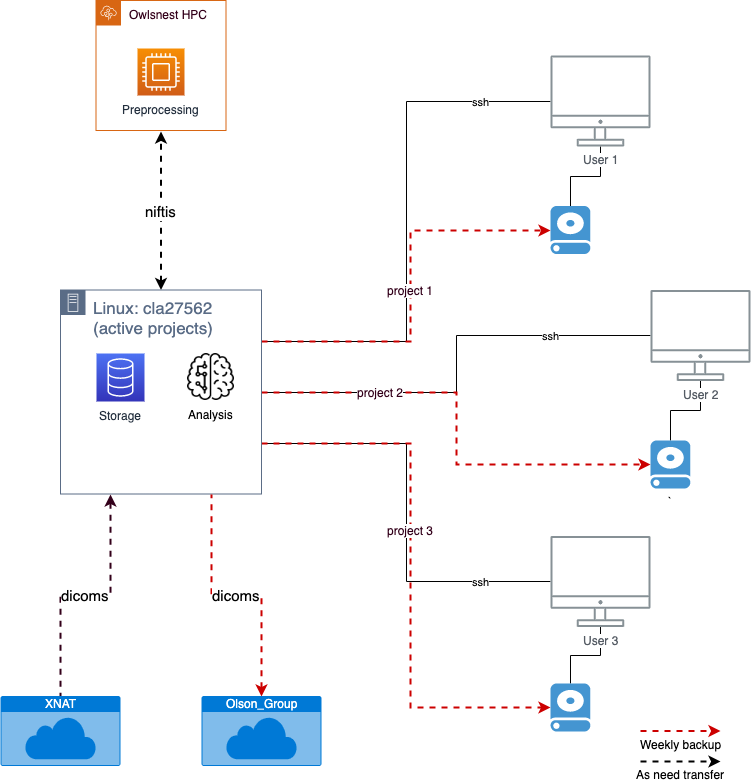

# Computing Overview




# Steps


## 1. Setting up BIDS
The Brain Imaging Data Structure is a standardized way to organize your data. It is standardized because there is a growing community of researchers who are adopting this structure. In my opinion, it makes intuitive sense and makes a lot of decisions that I would otherwise have to make, and likely change (on purpose or by accident) over the course of my career. Instead, every time I look at my data, I know where everything is. As you will see throughout this tutorial, there are a lot of tools that have been developed based on BIDS, which allow for some very easy and reproducible tasks to be completed. 

### 1.1 Making a BIDS directory
The first step is to create a directory which we will reference as the "BIDS directory" from here on out. This is the parent directory where ALL of the data for your project will live. On the Olson lab linux machine, this directory goes under /data/projects.

```{eval=FALSE}
mkdir /data/projects/relationship_knowledge

cd /data/projects/relationship_knowledge
```

Next we will make some subdirectories, in BIDS format. All of these subdirectories go in the BIDS directory you created above.

### 1.2 Raw dicoms
Raw dicoms go in the "sourcedata" subdirectory. 

```{eval=FALSE}
mkdir sourcedata
```

### 1.2 Scripts
Scripts go in the "code" subdirectory.

```{eval=FALSE}
mkdir code
```

### 1.3 Derivatives
All of the preprocessed data, analyses, and anything else that derives from your raw data goes in the "derivatives" subdirectory.

```{eval=FALSE}
mkdir derivatives
```

### Miscellaneous
I like to also make an "archive" subdirectory where I put things that don't really belong anywhere else. 

```{eval=FALSE}
mkdir archive
```

When I do this, I include the archive subdirectory in a ".bidsignore" hidden file. This is a text file that includes paths to files that you want the BIDS checker to ignore. The files listed here would otherwise give you BIDS errors.

```{eval=FALSE}
echo "./archive" >> .bidsignore
```


## 2. Prepping the data

### 2.1. Getting the data
TUBRIC researchers can access their data from XNAT once it is sent there from the scanner. From XNAT, one can download entire scan session for a subject, or individual scans. In this pipeline, we will be downloading the entire scan session. Once a subject's data is downloaded to a local computer, transfer it to the linux machine using rsync or scp.

```{eval=FALSE}
rsync test cla27562:/data/projects/relationship_knowledge/sourcedata/
```

If the data is zipped (i.e. if the extension is .tar.gz), then it can be unzipped with the following command:

```{eval=FALSE}
tar -xvf dicoms.tar.gz
```


### 2.2.Unpacking the data
This can be easily done with HeuDiConv, which utilizes BIDS to unpack the dicoms and create niftis in the appropriate locations. Liz Beard created a great [tutorial](https://github.com/TU-Coding-Outreach-Group/cog_summer_workshops_2021/blob/main/bids-heudiconv-fmriprep/bids_heudiconv_fmriprep.ipynb) on how to set up and run your HeuDiConv command with Docker during the 2021 COG summer workshops. 

The above tutorial goes over how to make a heuristics.py file, but I will review it here also. The heuristics.py file tells HeuDiConv what type of scans it should expect to find within the raw dicoms, and how those specific scans are named. For example, we can tell it that all T1 structural images will begin with the characters "t1w_". Heuristic files are specific to each project, because the scan names often change between projects. This is especially true for functional tasks scans. Below I have the contents of the heuristic.py file for my project:

```{python, eval=FALSE}
import os

def create_key(template, outtype=('nii.gz',), annotation_classes=None):
    if template is None or not template:
        raise ValueError('Template must be a valid format string')
    return template, outtype, annotation_classes
def infotodict(seqinfo):
    """Heuristic evaluator for determining which runs belong where
    allowed template fields - follow python string module:
    item: index within category
    subject: participant id
    seqitem: run number during scanning
    subindex: sub index within group
    """
    t1w = create_key('sub-{subject}/{session}/anat/sub-{subject}_{session}_run-{item:03d}_T1w')
    func_task = create_key('sub-{subject}/{session}/func/sub-{subject}_{session}_task-relscenarios_run-{item:03d}_bold')
    fmap_bold =  create_key('sub-{subject}/{session}/fmap/sub-{subject}_{session}_epi')
    dwi = create_key('sub-{subject}/{session}/dwi/sub-{subject}_{session}_run-{item:03d}_dwi')
    fmap_dwi_ap = create_key('sub-{subject}/{session}/fmap/sub-{subject}_{session}_dir-AP_dwi')
    fmap_dwi_pa = create_key('sub-{subject}/{session}/fmap/sub-{subject}_{session}_dir-PA_dwi')

    info = {t1w: [], func_task: [], fmap_bold: [], dwi: [], fmap_dwi_ap: [], fmap_dwi_pa: []}
    
    for idx, s in enumerate(seqinfo):
        if (s.dim1 == 256) and (s.dim2 == 256) and ('t1_mprage' in s.protocol_name):
            info[t1w].append(s.series_id)
        if (s.dim1 == 86) and (s.dim2 == 86) and (s.dim4 == 206) and ('func_task' in s.protocol_name):
            info[func_task].append(s.series_id)
        if (s.dim3 == 60) and (s.dim4 == 1) and ('gre_field_mapping' in s.protocol_name):
            info[fmap_bold] = [s.series_id]
        if (s.dim2 == 120) and (s.dim4 == 145) and ('hydi' in s.protocol_name):
            info[dwi].append(s.series_id)
        elif (s.dim2 == 120) and (s.dim4 == 2) and ('cmrr_fieldmapse' in s.protocol_name):
            if '_ap' in s.protocol_name:
                info[fmap_dwi_ap].append(s.series_id)
            elif '_pa' in s.protocol_name:
                info[fmap_dwi_pa].append(s.series_id)
    return info
```

To get some of this information you might have to run HeuDiConv in intial time to just pull information from dicom headers about the individual scans. Things like the number of dimensions each scan has and the TRs. I use the code below to do this:

```{eval=FALSE}
docker run --rm -it \
	-v /data/projects/relationship_knowledge:/base nipy/heudiconv:latest \
	-d /base/sourcedata/Olson-Relation_soc{subject}/*/DICOM/*.dcm \
	-o /base/ \
	-f reproin \
	-s 301 651 653 693 695 697 699 700 701 706 715 716 719 720 721 722 723 724 726 727 730 738 739 740 743 745 747 749 751 753 754 759 761 762 763 764 765 766 767 \
	-c none \
	--overwrite
```

Let's unpack what is going on here. First, the "docker" command is used. Then we have some flags which you can look up in the [HeuDiConv documentation](https://heudiconv.readthedocs.io/en/latest/usage.html) to see what they do. 

The "-v" flag takes an argument which specifies the BIDS directory and a second arguement "nipy/heudiconv:latest" which tells docker what program we are using. Remember docker is just a method to run other programs. It doesn't do anything by itself. 

The "-d" flag speficies that path to find dockers. Wildcards (*s) are used to specify slight differences between subjects. And then the "{subject}" variable is used to do this for multiple subjects.

The "-s" flag is used to specify your subjects. This can be done for a single subject, or a list as I have here.

This will also create the hidden .heudiconv subdirectory with in the BIDS directory. If you are in your BIDS directory hit "ll" or "ls -l" to list all the contents of the directory (including the hidden files). There you can see what the above command did and check out the relevant files to find your scan information. When you are ready, you can run heudiconv again with a slight change to create the nifti files.

Below is the code I use to create the raw nifti files within my BIDS directory on our lab's linux machine:

```{eval=FALSE}
docker run --rm -it \
	-v /data/projects/relationship_knowledge:/base nipy/heudiconv:latest \
	-d /base/sourcedata/Olson-Relation_soc{subject}/*/DICOM/*.dcm \
	-o /base/ \
	-f /base/code/heuristic.py \
	-s 301 651 653 693 695 697 699 700 701 706 715 716 719 720 721 722 723 724 726 727 730 738 739 740 743 745 747 749 751 753 754 759 761 762 763 764 765 766 767 \
	-ss 001 \
	-c dcm2niix -b \
	--overwrite
```

Note that now we are using the "dcm2niix" arguement for the "-c" flag. Also, note that I have specified a session number with the "-ss 001" argument. This does not need to be done if your project does not have multiple scan sessions. Users should note this throughout this tutorial, as their file paths will look different from mine, because I specify that session number in my paths.

After running HeuDiConv, you should see that there are subject folders in your BIDS directory. These files are admin protected, meaning that you will not be able to change or remove them until you had admin (i.e. sudo) privileges. These files are created with these protections so that they are not accidently changed. In most cases, you will never have to mess with them anyways. Nothing else should be put in them, otherwise there will be a BIDS violation. This is especially useful if multiple people are working on this dataset, so that everyone can reference the say raw data, without creating duplicates or creating changes that would mess up other people's workflow. 


## 3. Setting up backups
In the Olson lab, we have set up a series of backups so that data is stored in multiple places in the event that something horrible happens to our linux machine. There are two methods of back up:

### 1. Raw dicom backup
Raw dicoms are copied to the Olson lab shared drive. Since space on the shared drive is shared across the whole department, we are trying to be conservative and only backup the raw dicoms. Should something happen to all the computers in the lab, this raw data will still be accessible, but projects would have to be reanalyzed from the beggining (hopefully you have good scripts and documentation for your project!). 

### 2. Whole project directory backup
As depicted in the Olson lab computing graphic in section 1, the Olson lab utilizes external hard drives, connected to individual user computers to back up entire project directories. If you project is in BIDS format, this is very easy because the entire parent BIDS directory (e.g. /data/projects/relationshp_knowledge) can be backed up. This would include all the raw dicoms, raw niftis, preprocessed data, analyzed data, scripts, and everything else that is in the BIDS directory. Should something horrible happen to the linux, everything you have done for a given project will be available to you (depending on how often this backup is done). The external hard drives we use are very large (5 TBs), which is more than enough for a typical MRI dataset.

### Automating backups
The Olson lab uses cron jobs to automatically complete these two back ups on a weekly basis. Creating and crob jobs can be complicated and require good bash skills. Cron jobs are created on user Mac computers. Simply put, a cron job is a command that you set up to run at a desired frequency. The syntax is as follows

```{eval=FALSE}
* * * * * [command to run]
```

The *s above indicate the frequency that the command listed afterwards should run. More information on how to set up this frequency is available [here](https://linuxize.com/post/scheduling-cron-jobs-with-crontab/). Below is an example of the two cron jobs, each completing one of the backups described above:

```{eval=FALSE}
# Back up Olson-Relation project directory
0 1 * * 2 rsync -a cla27562:/data/projects/relationship_knowledge /Volumes/RELATION/

# Back up Olson-Relation dicoms
0 4 * * 2 rsync -a cla27562:/data/projects/relationship_knowledge/sourcedata /Volumes/psychology/Olson_Group/Backups/MRI_data_backups/relationship_knowledge/
```
Can you guess when these are scheduled to run? Answer: at 1am and 4am on every Tuesday.


## 4. Preprocessing
Preprocessing can be done on a linux machine fairly quickly. However, if your linux machine is a shared resource within or across labs, you might want to consider using Temple's Owlsnest to complete your preprocessing instead. Owlsnest is a high-performance cluster (HPC) and has a lot more computing power than a single linux machine. For example, a linux machine might have 48 cores or CPUs. Owlsnest has 28 cores for a given node, and users can request multiple nodes to complete their processing. The downside to using Owlsnest is that it can be hard to learn how to properly use. This is mostly because it is a widely shared resource (across the university), and with so many users, there needs to be very strict rules that all users must follow so that the resources can be used properly and fairly. If one hogs all the resources, or uses them in a dangerous way, there will be less resources for others. If you are using fmriprep to preprocess your data, the command used is the same whether you are preprocessing on a linux machine or on Owlsnest. However, with Owlsnest there is a special way you need to run this command, given its special nature.

### Running fmriprep on a linux machine with Docker
First, we will briefly go over how to run fmriprep using docker on a linux. Much of this material is copied from [Liz Beard's tutorial](https://github.com/TU-Coding-Outreach-Group/cog_summer_workshops_2021/blob/main/bids-heudiconv-fmriprep/bids_heudiconv_fmriprep.ipynb) we mentioned previously. Here, we will use "fmriprep-docker":

```{eval=FALSE}
fmriprep-docker \
	/data/projects/relationship_knowledge/ \
	/data/projects/relationship_knowledge/derivatives participant \
	--participant-label 697 706 716 \
	--fs-license-file /usr/local/freesurfer/license.txt
```

Here is a breakdown of each line of code:

Specify the BIDS directory
```{eval=FALSE}
/data/projects/relationship_knowledge/derivatives participant \
```

Specify where you want the output of fmriprep (a subdirectory that will be called "fmriprep") to be put
```{eval=FALSE}
/data/projects/relationship_knowledge/ \
```


Specify the subject(s) you want to preprocess
```{eval=FALSE}
--participant-label 697 706 716 \
```

Provide a freesurfer license. Freesurfer is not required to be run with fmriprep, but you will have to specify that. If you want freesurfer to be run, you will need to get a [free license from freesurfer](https://surfer.nmr.mgh.harvard.edu/fswiki/License) and tell fmriprep where that license is. I have freesurfer also installed on our lab's linux machine so I am just specifying that license. 
```{eval=FALSE}
--fs-license-file /usr/local/freesurfer/license.txt
```


### Running fmriprep on an HPC using singularity
If you want to preprocess your data on an HPC like Temple's Owlsnest, you will have to use singularity. Docker inherently uses admin access to do things. If you see the output of HeuDiConv of fmriprep using "ll" or "ls -l", you'll see that the creater of those files is "root", not you. HPCs do not like this. As discussed above, HPCs are a shared resource so everyone has to play by the rules. Users generally don't have admin access, otherwise chaos might ensue. So instead of docker, we can use singularity to run fmriprep. 

#### Creating a singularity image
First, you will have to get a singularity image. This can be done with singularity, if you have it installed on your linux machine with the following command:

```{eval=FALSE}
singularity build /my_images/fmriprep-<version>.simg docker://poldracklab/fmriprep:<version>
```

If you don't have singularity on a local machine, you can use docker with the following command:

```{eval=FALSE}
docker run --privileged -t --rm \
    -v /var/run/docker.sock:/var/run/docker.sock \
    -v D:\host\path\where\to\output\singularity\image:/output \
    singularityware/docker2singularity \
    poldracklab/fmriprep:<version>
```

**Note:** These singularity images are very large (over 1 GB).

This singularity image will need to be transferred to Owlsnest.

#### Downloading the templateflow directory
Another feature that might be common with HPCs is that they do not allow internet access within nodes. fmriprep likes to connect to the internet to temporarily download standard templates like the MNI brain for preprocessing steps. Owlsnest does not allow this. So instead, we will have to pre-download those templates, called the "templateflow" directory. This can be done with the following command on a local machine, utilizing python:

```{eval=FALSE}
export TEMPLATEFLOW_HOME=/path/to/keep/templateflow
$ python -m pip install -U templateflow  # Install the client
$ python
>>> import templateflow.api
>>> templateflow.api.TF_S3_ROOT = 'http://templateflow.s3.amazonaws.com'
>>> api.get(‘MNI152NLin2009cAsym’)
```

This directory will need to be transferred to Owlsnest.

#### Creating a job script
The last important thing to know about using an HPC is how to submit jobs. When you log into an HPC, you are in a "login node". Consider this a shared CPU (or something like that), that everyone uses to login. Computations should NOT be performed here. Doing so would overwork the login node (or something like that, which might mean other people can't login, but I don't know). Instead, you must submit a job, which exports your task to be completed by other computing resources that you specify within the job script. HPC like Owlsnest typically have schedulers which schedule submitted jobs so that users can efficiently share the computing resources in a fair way. For example, if you need 100 CPUs to complete a job, but all 500 are currently being used, the scheduler will wait to submit your job once 100 become available (and in the meantime, use the CPUs that are available for other people's jobs). On Owlsnest, there are nodes with 28 CPUs each. When you submit a job and request CPUs, you are doing it by the node. So even if you ask for 5 CPUs, you need to check out the entire node, because another user will not be able to use that node anyways. One should keep this in mind for what they plan on using the HPC and how they use it. If you're submitting a bunch of jobs that only require 5 CPUs each, that is a lot of nodes that are being reserved for you, when you are not fully utilizing each node. Instead one should do some math and consider how they can fully use all the resources that they need to check out. 

So first, we will go over the basics of how to create a job script. Then we will go over how to use computing resources efficiently. Below is an example of a script (fmriprep_hpc.sh) which runs fmriprep for one subject:

```{eval=FALSE}
#!/bin/sh
#PBS -l walltime=24:00:00
#PBS -N Relation-fmriprep
#PBS -q normal
#PBS -l nodes=1:ppn=8
#PBS -m bae
#PBS -M tuk12127@temple.edu


# Import relevant modules
module load singularity

cd $PBS_O_WORKDIR


# Define templateflow directory for within the singularity container
export SINGULARITYENV_TEMPLATEFLOW_HOME=/home/fmriprep/.cache/templateflow

singularity run -B ~/work/relationship_knowledge/archive/templateflow:/home/fmriprep/.cache/templateflow \
        --cleanenv archive/fmriprep-20.1.1.simg  \
        /home/tuk12127/work/relationship_knowledge /home/tuk12127/work/relationship_knowledge/derivatives \
        participant \
        --participant-label ${subj} \
        --fs-license-file ~/work/license.txt \
        --notrack \
        --skip_bids_validation
```

The first section tells Owlsnest some information about the nature of this job. Below, we will review a couple of these options. Users should reference the [Owlsnest documentation](https://www.hpc.temple.edu/owlsnest2/batch_system/job_scripts/) and be familiar with all of the other options. 

```{eval=FALSE}
#PBS -l walltime=24:00:00
```
This defines the upper limit of the job. After this specified time as elapsed, the job will stop. The scheduler also reads this information to know how long you expect to use resources for. So it is good to keep this number close to the time you expect your job to take so that if completes fully and so that it doesn't take longer than necessary to begin running. **Test your jobs before submitting an intensive one.**


```{eval=FALSE}
#PBS -l nodes=1:ppn=8
```
This tells the scheduler how much computing resources to reserve for the job. This should be modified for every job to ensure that it is accurate. Requesting too many resources or requesting reguesting resources and using them inefficiently is a good way to get in trouble with the Owlsnest people. You don't want to do this. Luckily with fmriprep, you see their documentation and do some math to figure out how much resources you need. I typically use 8 CPUs per subject. Using more or less doesn't increase or decrease the preprocessing time by a significant amount. **Note:** In this example we are requesting 1 node with 8 CPUs to preprocess one subject. This is okay to do on an occasional basis. For example, once a week as you preprocess each subject immediately after collecting the data. It is not efficient to submit multiple jobs like this, for example if you wanted to preprocess an entire dataset of 40 subjects. That would mean requesting 40 nodes with only 320 out of a potential 1,120 CPUs being used (each node has 28 CPUs whether or not you use them). An example of how to do this part efficiently will be later in this tutorial.

The next section of code tells Owlsnest what programs we will be using.
```{eval=FALSE}
# Import relevant modules
module load singularity
```
One advantage of using containers like singularity is that the container image has all the programs and scripts that are needed to complete your task. So instead of having to specify FSL, AFNI, python, and a bunch of other stuff here that Owlsnest might not support, we can just load the singularity module and run fmriprep with a singularity image. 


## 5. Analyses
